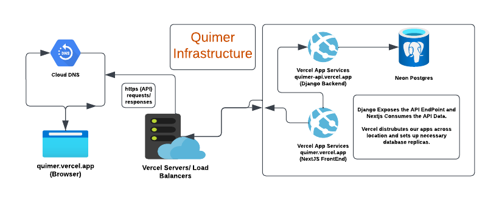
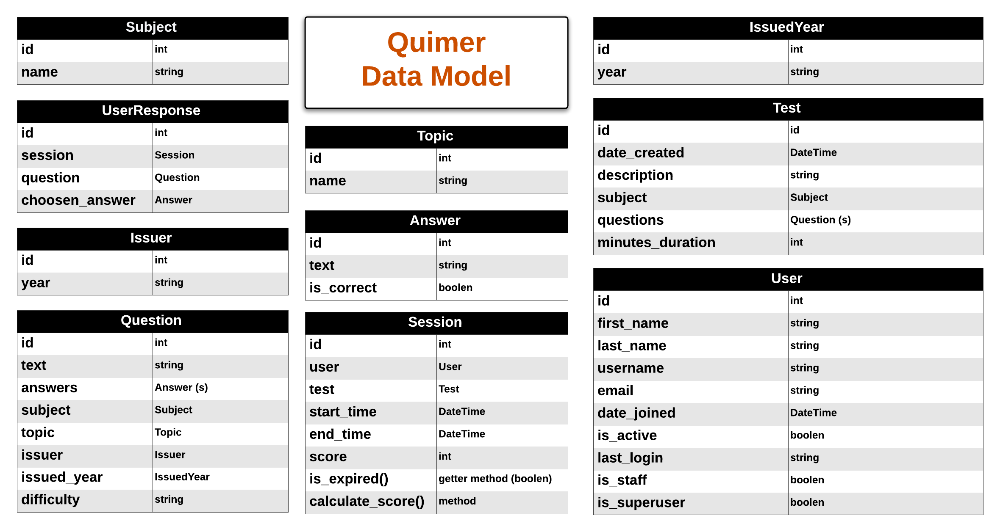

# Quimer
Quimer is a CBT (Computer Based Test) System that allows users to create and take custom tests and equally prep for external exams like JAMB, WAEC or NECO using the exam bodies past questions.

# Introduction
Quimer ([quimer.vercel.app](https://quimer.vercel.app/)) is a CBT (Computer Based Test) System that allows users to create and take custom tests and equally prep for external exams like JAMB, WAEC or NECO using the exam bodies past questions. It is aimed at solving most of the limitations attached to the traditional paper-based test system.

# Features
Quimer has the following features:

- User Authentication: Users can sign up, login and logout of the platform.
- User Profile: Users can view and update their profile.
- Test Creation: Users can create custom tests questions and answers as issuers.
- Test Taking: Users can take tests and view their scores.
- Test History: Users can view their test history and performance metrics.
- Exam Prep: Users can prep for external exams like JAMB, WAEC or NECO using the exam bodies past questions.
- Admin Dashboard: Admins can view, create, update and delete all users, tests and test results.

# Installation and Usage
Guideline on how to install the project:

- git clone `https://github.com/leonardnzekwe/quimer.git`
- Backend (API):
- - From the project root, cd into the `core` directory
- - Run `pip install -r requirements.txt` to install the backend packages.
- - Add the database conneciton strings in the environmental variable or just use sqlite
- - Then run `python manage.py runserver` to start the local development server
- Frontend (WEB):
- - From the project root, cd into the `web` directory
- - Run `npm install` to install all the frontend dependencies
- - Add the `NEXT_PUBLIC_BACKEND_URL` environmental variable string
- - Then run `npm run dev` to start the local developement server

# Contributing Team
The Lafia HMS was built as team by:

- [Rahmat Folorunsho](https://github.com/rahma-cloud) - UI/UX/Frontend
- [Ifeanyi Akamigbo](https://github.com/valentine1244) - Frontend/Backend
- [Leonard Nzekwe](https://github.com/leonardnzekwe) - Backend/DevOps

# Technology
We strived to follow the industry best standards. So we separated our backend logic from our front end logic. We exposed the data via Graphql and Rest API. We used the following technologies to build the project:

- Backend (API):
- - Language: Python
- - Rest API Framework: Django, Django Rest Framework
- - GraphQL API Framework: Graphene Django
- - Authentication: JWT (JSON Web Token) && Session
- - ORM: Django ORM
- - Database: Postgres
- Frontend (UI):
- - Language: Typescript
- - Web Framework: Nextjs
- - Styling Framework: Tailwind CSS
- - State Management && Auth: Next Auth
- - HTTP Client: Axios
- - GraphQL Client: Apollo Client
- UI/UX (Design):
- - Tool: Canva
- Hosting Platforms:
- - Frontend & Backend - Vercel
- - Database - Neon Postgres
- - Codebase - Github

# Architecture

Quimer Architecture is a simple monolithic architecture that is divided into two main parts: the backend and the frontend. The backend is built with Django, Django Rest Framework and Django Graphene Graphql Server, while the frontend is built with Nextjs, Next Auth and Apollo Client. The frontend consumes the backend API endpoints to display the data to the user. For authentication it uses the rest api and for all other data querying and mutations it uses the graphql api. The quimer codebase is a monorepo.

# Infrastructure

# Data Model

# API Documentation

- Rest API Documentation can be found:
- - Gitbook: [docs.netrobase.dev/quimer-docs](https://docs.netrobase.dev/quimer-docs)
- - Repo API Directory: [core/README.md](core/README.md)

- GraphQL API Doc and Playground can be found at [quimer-api.vercel.app/graphql](https://quimer-api.vercel.app/api/graphql)

# License

This project is licensed under the MIT License - see the [LICENSE](LICENSE) file for details.
